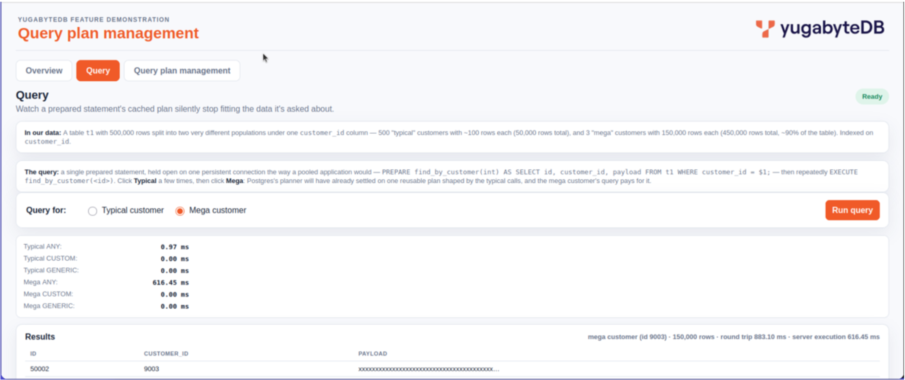

# Query Optimizer

A hands-on collection of YugabyteDB query-optimizer exercises and a small
Flask demo app, built to explore how YSQL's cost-based optimizer actually
behaves on a live cluster -- indexing strategy, join order, correlated
subqueries, `pg_hint_plan`, and YugabyteDB's built-in Query Plan Management
(QPM) feature -- verified end to end against a real cluster rather than
reasoned about in the abstract.

Every exercise here was run for real: `EXPLAIN (ANALYZE, BUFFERS)` output is
captured, not hand-written, and several early assumptions were revised after
the cluster disagreed with them.

## What's in this repo

| Path | Contents |
|---|---|
| `20 - sql/` | Baseline SQL/data setup used by the web demo (table `t1`) |
| `22 - labs/` | Numbered, self-contained query-optimizer exercises (see below) |
| `60_index.py`, `44_static/`, `45_views/` | The Query Plan Management demo web app (Flask) |
| `48_slides/` | Slide deck and PDF export walking through the demo's findings |
| `libraries/` | Small Python helpers (config loading, DB connection) used by the demo app and its test scripts |

## The lab exercises (`22 - labs/`)

Each exercise follows the same convention: tables/columns are always named
generically (`t1`, `t2`, `col1`, `col2`, ...) regardless of what real-world
scenario inspired them, and every numbered `.sql` file has a matching `.sh`
wrapper plus a captured `.txt` output file showing the real, verified plan.
Where an exercise has a follow-up variant, it's suffixed `b`, `c`, etc.
(e.g. `05` &rarr; `05b` &rarr; `05c`).

Highlights:

- **01-02** -- indexing fundamentals: hash vs. range sharding, why a
  HASH-sharded key can't serve a range scan at all.
- **03 / 03b / 03c** -- pattern-matching indexes: the "reverse index" trick
  for suffix `LIKE` queries, a custom operator wrapping it, and a `pg_trgm`
  trigram index for full mid-string matching.
- **04 / 04b** -- outer join mechanics: why a `LEFT JOIN`'s preserved side
  must drive a Nested Loop, and why no planner hint can force the reverse.
- **05 / 05b / 05c** -- the "`SELECT DISTINCT` because the join duplicated
  rows" anti-pattern, fixed by precomputing the qualifying set once instead
  of de-duplicating on every query, then kept in sync incrementally via a
  trigger.
- **06 / 06b / 06c** -- correlated subqueries vs. a single `GROUP BY` pass:
  a ~100x speedup by eliminating N per-row `SubPlan` executions, then a
  further ~2x from a covering index that removes the `HashAggregate`
  entirely.
- **07 / 07b / 07c** -- a real, anonymized customer case (composite index
  column ordering, `Index Cond` vs. `Storage Filter`, and `pg_hint_plan`
  used to deliberately reproduce -- then measure -- a historical bad plan
  alongside YSQL's actual (much better) default behavior).

## The Query Plan Management demo (`60_index.py`)

A three-tab Flask app demonstrating a real, naturally-occurring query plan
regression on a live YugabyteDB cluster, and where automatic detection does
and doesn't help:

- **Overview** -- slideshow (images placed in `48_slides/`).
- **Query** -- the live regression. Table `t1` (500,000 rows) holds 500
  "typical" customers (~100 rows each) and 3 "mega" customers (~150,000 rows
  each) under one `customer_id` column. A single prepared statement is held
  open on one persistent connection, the way a pooled application driver
  would:
  ```sql
  PREPARE find_by_customer(int) AS
     SELECT id, customer_id, payload FROM t1 WHERE customer_id = $1;
  ```
  Click **Typical** a few times, then click **Mega** -- with
  `plan_cache_mode = auto` (the default), Postgres/YSQL settles on one
  reusable plan shaped by the typical calls, and the mega customer's query
  pays for it: a real, measured slowdown, no error, nothing in the
  application to flag it. Flip **plan_cache_mode** to `force_custom_plan`
  and rerun to see it recover.
- **Query Plan Management** -- live, not a placeholder: this tab queries
  YugabyteDB's built-in `yb_pg_stat_plans` / `yb_pg_stat_plans_insights`
  system views directly. It's a genuinely important finding of this project
  that QPM's automated `plan_require_evaluation` ("needs review") flag does
  **not** catch this specific regression -- it checks whether the
  cheapest-estimated plan for a query is also the fastest in practice, not
  whether a session's currently-cached plan has gone stale for an unusual
  parameter. The two failure modes look similar but are genuinely
  different, and only one of them is what this flag was built to catch.

## Configuration

Copy `properties.ini.example` to `properties.ini` and fill in your own
cluster's `[database]` host/port/name/user/password. `properties.ini` itself
is intentionally left out of this repo (see `.gitignore`) -- it's local
configuration, not something to publish.

## Start and stop

```bash
bash '61 - Start query plan management web UI.sh'
bash '63 - Query plan management web UI status.sh'
bash '62 - Stop query plan management web UI.sh'
```

Then open `http://<host>:5048`.

On every start, the app creates the `my_db48` database and `t1` table (with
data and index) if they don't already exist, and re-runs `ANALYZE` so
planner statistics stay current. Existing data is preserved across
restarts, since the point is a stable, known dataset that reproduces the
same regression repeatedly.

## Slides (`48_slides/`)

A slide deck and PDF export covering the same material as this README, in
presentation form.
